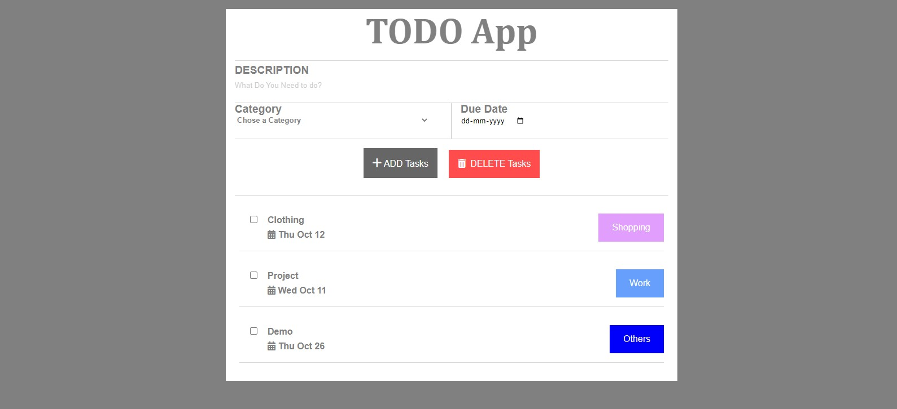
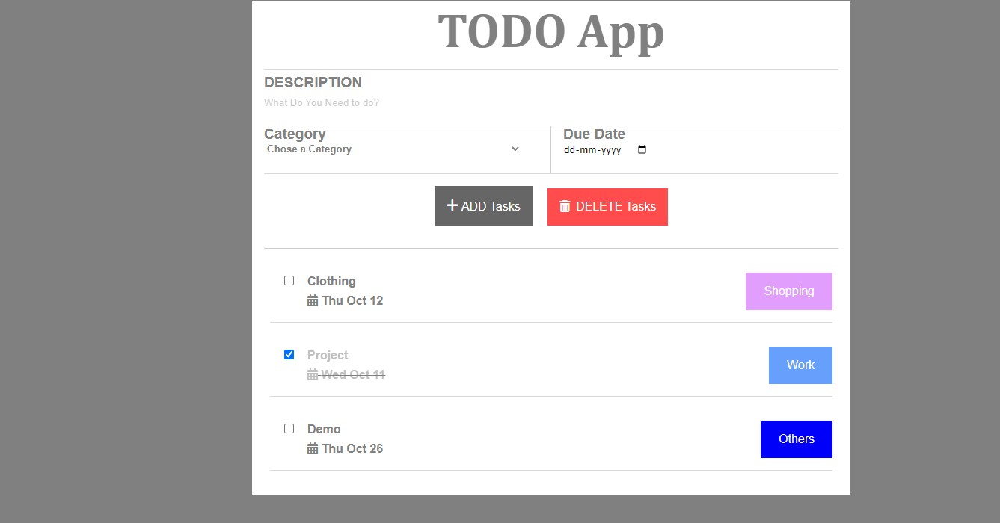

<div align="center" id="top"> 
  

  &#xa0;

  <!-- <a href="https://todolist.netlify.app">Demo</a> -->
</div>

<h1 align="center">Todolist</h1>

<p align="center">
  

  

  

  

  <!--  -->

  <!--  -->

  <!--  -->
</p>

<!-- Status -->

<!-- <h4 align="center"> 
	🚧  Todolist 🚀 Under construction...  🚧
</h4> 

<hr> -->

<p align="center">
  <a href="#dart-about">About</a> &#xa0; | &#xa0; 
  <a href="#sparkles-features">Features</a> &#xa0; | &#xa0;
  <a href="#rocket-technologies">Technologies</a> &#xa0; | &#xa0;
  <a href="#white_check_mark-requirements">Requirements</a> &#xa0; | &#xa0;
  <a href="#checkered_flag-starting">Starting</a> &#xa0; | &#xa0;
  <a href="#memo-license">License</a> &#xa0; | &#xa0;
  <a href="https://github.com/Rishabh-hubb" target="_blank">Rishabh</a>
</p>

<br>

## :dart: About ##

TodoList is a todo app for managing your work. It is built using Node,Express,MongoDB,Mongoose,HTML,CSS,EJS,JavaScript.
## :sparkles: Features ##

:heavy_check_mark: Add a Todo;\
:heavy_check_mark: Delete a Todo;\
:heavy_check_mark: Add a Todo along with category;

## :rocket: Technologies ##

The following tools were used in this project:

- [Express](https://expressjs.com/)
- [Node.js](https://nodejs.org/en/)
- [MongoDB](https://www.mongodb.com/)
- [Mongoose](https://mongoosejs.com/docs/)
- [HTML]
- [JavaScript]

## :white_check_mark: Requirements ##

Before starting :checkered_flag:, you need to have [Git](https://git-scm.com) and [Node](https://nodejs.org/en/) installed.

## :checkered_flag: Starting ##

```bash
# Clone this project
$ git clone https://github.com/Rishabh-hubb/todolist

# Access
$ cd todolist

# Install dependencies
$ npm install

# Run the project
$ nodemon index

# The server will initialize in the <http://localhost:8000>
```

## screenshots ##






Made with :heart: by <a href="https://github.com/Rishabh-hubb" target="_blank">Rishabh</a>

&#xa0;

<a href="#top">Back to top</a>
